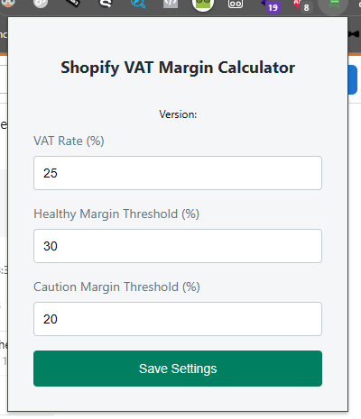
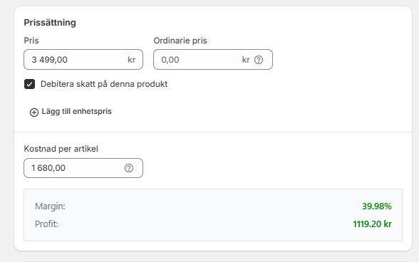

# Shopify VAT Margin Calculator

A Chrome extension that calculates and displays margin and profit for Shopify products, taking VAT into account.

## Features

- Automatically calculates margin and profit for Shopify products
- Customizable VAT rate
- Adjustable thresholds for healthy and caution margins
- Real-time updates as you change product prices or costs
- Easy-to-use popup interface for settings

## Installation

1. Clone this repository or download the ZIP file and extract it.
2. Open Chrome and go to `chrome://extensions/`.
3. Enable "Developer mode" in the top right corner.
4. Click "Load unpacked" and select the folder containing the extension files.

## Usage

1. Navigate to a Shopify product page in your store's admin area.
2. The extension will automatically calculate and display the margin and profit below the unit cost field.
3. To adjust settings, click on the extension icon in your Chrome toolbar.
4. In the popup, you can set:
   - VAT Rate (%)
   - Healthy Margin Threshold (%)
   - Caution Margin Threshold (%)
5. Click "Save Settings" to apply your changes.

## Files

- `popup.html`: The HTML structure for the settings popup
- `popup.js`: JavaScript for handling user input in the popup
- `content.js`: The main script that calculates and displays margin information
- `styles.css`: Styles for the margin display on the Shopify product page
- `manifest.json`: Chrome extension configuration file

## Images

_The settings popup for the Shopify VAT Margin Calculator_

_Example of margin and profit display on a Shopify product page_

## Development

To modify the extension:

1. Make changes to the relevant files.
2. If you modify `manifest.json`, you may need to reload the extension in Chrome.
3. For other file changes, simply refresh the Shopify product page to see updates.

## Contributing

Contributions are welcome! Please feel free to submit a Pull Request.

## License

This project is open source and available under the [MIT License](LICENSE).

## Credits

Developed by Liam Lenholm

## Version Checker

This extension includes an automatic version checking feature to ensure you're always using the latest version.

### How it works:

1. The current version of the extension is stored in the `version-check.js` file.
2. On startup, the extension fetches the latest version information from a `version.json` file in the GitHub repository.
3. If a newer version is available, a notification will appear in the popup with a link to the GitHub repository for updates.

### Updating the extension:

When a new version is released:

1. The `version.json` file in the GitHub repository will be updated.
2. Users will see an update notification in the extension popup.
3. Click the provided link to visit the GitHub repository and download the latest version.

### For developers: 

To update the version:

1. Modify the `currentVersion` variable in `version-check.js`.
2. Update the `version` field in `manifest.json`.
3. Update the `version.json` file in the GitHub repository.

This system ensures that users are promptly notified of new releases while maintaining a streamlined update process.
